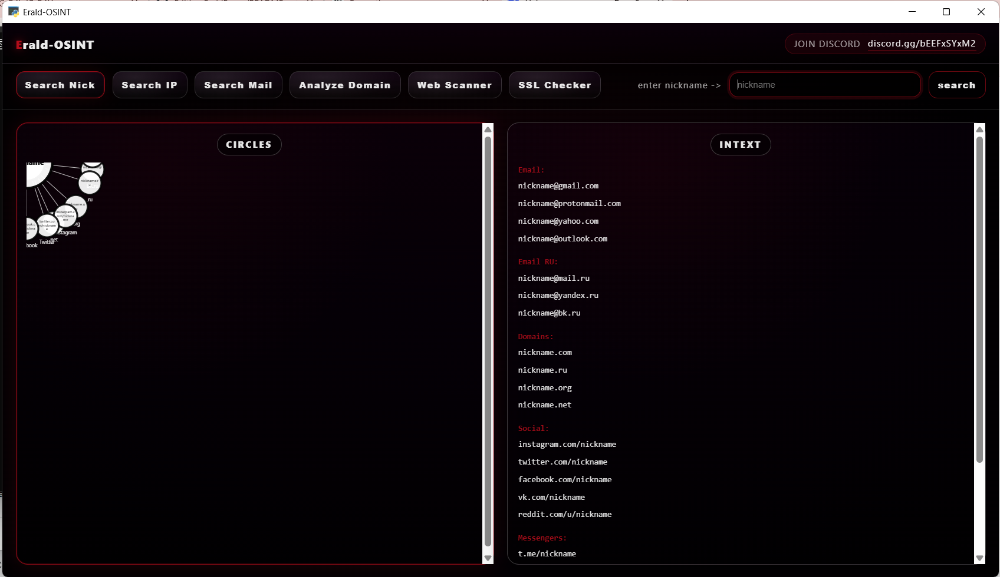

# Erald-OSINT


Alat OSINT sederhana dengan antarmuka grafis untuk investigasi digital.

Alat OSINT sederhana dengan antarmuka grafis untuk investigasi digital.



## Fitur
- **Search Nick** - Cari username dan generate email
- **Search IP** - Lacak lokasi IP dan informasi ISP
- **Search Mail** - Generate variasi email dari username
- **Analyze Domain** - Lihat catatan DNS (A, MX, TXT, NS)
- **Web Scanner** - Deteksi teknologi website
- **SSL Checker** - Analisis sertifikat SSL/TLS

## Instalasi
```bash
pip install webview requests
python "Erald-OSINT.py"
